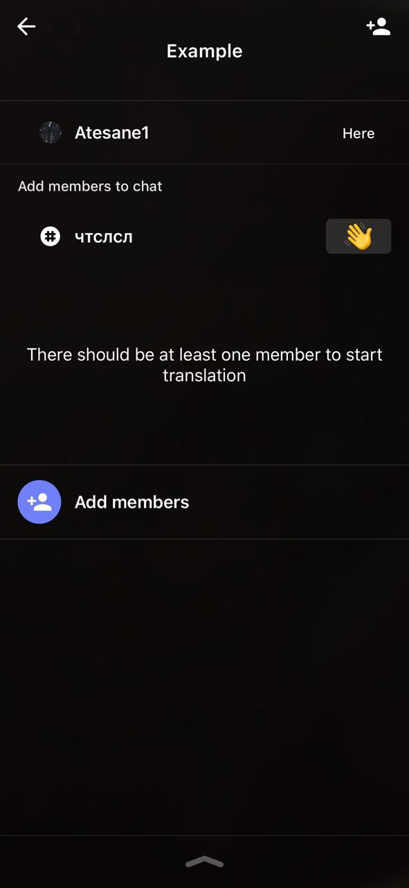
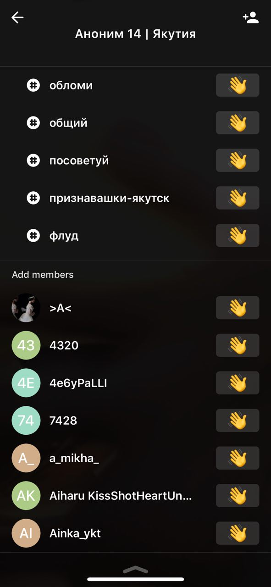
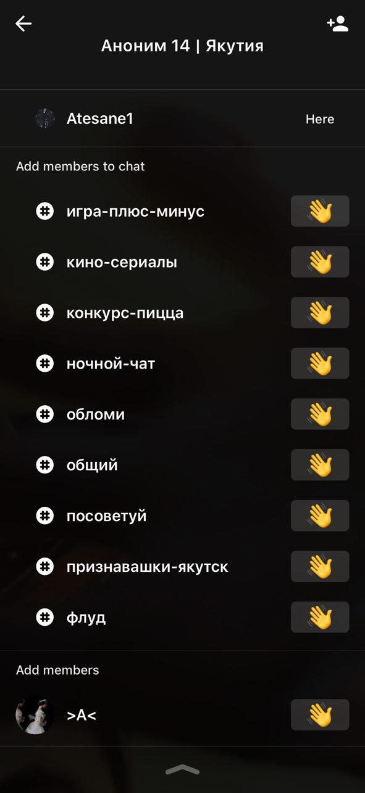
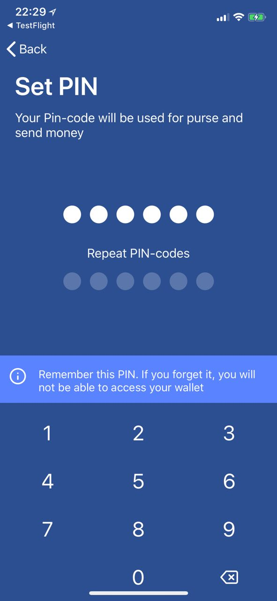
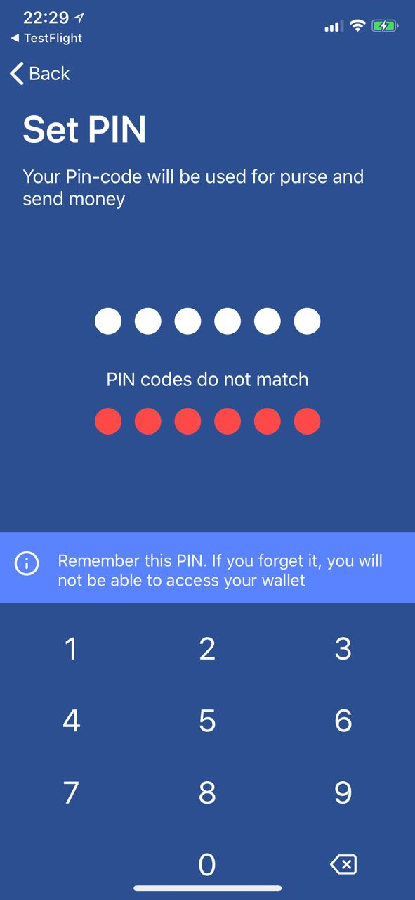

# iOS-Portfolio
Recent iOS projects code portfolio

## HiveChat

Project is written with Objective-C. Example represents video chat members list. Specifically, it contains active video chat members, group's chats and other chat members
User can invite members to join video chat by tapping "hand" button. Group's chats and other chat members sections support batch loading
CollectionView sections follows modular pattern - that is, each section managed by loosely coupled set of classes
Technology stack includes RestKit, WebRTC and own developed framework. Our framework simplifies list-based controller development workflow: loosely coupled collection view sections, batch item loading etc.

## SolWallet

Project is written with Swift. Example represens pin creation screen. User enters pin, then repeats it. If pins match, pinCreatedHandler invoked. Otherwise, screen displays error message
Technology stack includes RxSwift, Moya+ObjectMapper. Network request mapping level was extended with Core Data entity support.

## Sticker App

This app has quite straightforward goal - it allows user to view and download stickers for WhatsApp.
The architecture employs dependency injection for component decoupling as well as Rx + Model-View-Interactor to orchestrate components.
